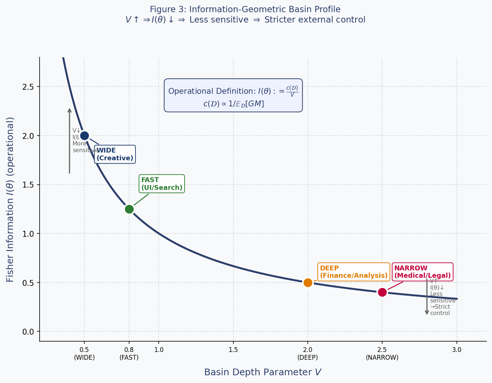

# ReikaSystem v11.0

**External Control Framework for Large Language Models**

**Author**: Takayuki Ishii (Independent Researcher)  
**arXiv**: (submission pending — endorsement code: 4RKRCC)  
**License**: MIT

---

## What is ReikaSystem?

ReikaSystem is an external control protocol for LLMs designed to prevent **Halation**: outputs that are fluent and internally coherent, yet structurally wrong due to missing dependencies, drifting definitions, or insufficient grounding.

ReikaSystem treats the LLM as a **candidate generator whose outputs carry no inherent authority**, routing all decision authority through an external, auditable control layer.

---

## Core Principles

- **Empty Set Principle**: `LLM ∩ GroundTruth = ∅` / `LLM ∩ PersistentState = ∅` / `LLM ∩ DecisionAuthority = ∅`
- **RF/GM Risk Model**: Detects imbalance between Rhetorical Fluency (RF) and Grounding Mass (GM)
- **HOLD-as-Success**: Abstention is a positive safety outcome, not a failure
- **Layer 0**: Deterministic pre- and mid-generation fingerprint detection for early exit
- **Safety-First Gating**: Exponential reweighting of observer scores toward safety
- **Deterministic observers only**: LLM-as-judge reintroduces the untrusted element — all observers are non-generative

---

## Halation vs. Hallucination

|  | Hallucination | Halation |
|---|---|---|
| Cause | Knowledge gap / fabrication | RF/GM structural imbalance |
| Surface | Factually wrong | Fluent, plausible, locally coherent |
| Fix | Retrieval (RAG) | External control + routing |

---

## Routing Actions

| Action | Condition |
|---|---|
| OUTPUT | Low Ht, low Lt, Prism pass |
| RETRIEVE | High hallucination risk (Ht) |
| CLARIFY | Structural ambiguity or observer concern |
| HOLD | Dual high-risk — safe abstention |
| SOFT_HOLD | High Lt only — annotated output with `[requires-verification]` |

---

## One-line Description

> **LLMの出力に生じる構造的歪み（Halation）を、外部deterministicフレームワークで検知・制御するシステム**
>
> *A system that detects and controls structural distortion (Halation) arising in LLM outputs through an external deterministic framework.*

---

## Architecture

### Figure 1: High-Level Architecture


The generation lane (LLM) produces candidates; the external control layer evaluates and routes to OUTPUT / RETRIEVE / CLARIFY / HOLD.

### Figure 2: Routing Policy in the (Ht, Lt) Risk Plane


Real-time routing based on Hallucination Risk (Ht) and Halation Risk (Lt). Dashed lines indicate configurable thresholds (θH, θL).

### Figure 3: Information-Geometric Basin Profile (v12 candidate)


Operational definition: `I(θ) := c(D)/V` where c(D) reflects domain grounding density.
Deeper basins (NARROW/Medical) require stricter external control; shallower basins (WIDE/Creative) allow higher tolerance.

### Figure 4: Multi-LLM Deliberation Structure


Each LLM generates candidates independently with distinct RF/GM characteristics. The C-layer holds all decision authority (`LLM ∩ DecisionAuthority = ∅`).

> **Note**: Loading all four figures into an LLM context (without additional explanation) is sufficient to reconstruct the full ReikaSystem design philosophy. Empirically verified with multiple LLMs in temporary chat sessions.

---

## Files

| File | Description |
|---|---|
| `reika_system_v11_5_final.py` | English reference implementation (v11.5, 876 lines, frozen candidate) |
| `reika_system_v11_5_ja.py` | Japanese-enhanced implementation (v11.5, 934 lines) |
| `reika_v11_tikz_v13.tex` | Paper source (LaTeX, v11.0 + v11.5 additions, 2026-04-25) |
| `reika_figure1.png` | Architecture diagram |
| `reika_figure2_v2.png` | Risk plane routing diagram (Y-axis fixed) |
| `reika_figure3.png` | Information-geometric basin profile (v12 candidate theory) |
| `reika_figure4.png` | Multi-LLM deliberation structure |

---

## v11.5 Patch Summary

- **SeedMatcher**: corpus-local TF-IDF proxy (replaces bag-of-words cosine)
- **ImplicitDependencyDetector**: future-reference + unresolved-variable flags for Ht strengthening
- **Japanese enhancement**: RF/GM observers, FingerprintMonitor, Prism extended with Japanese connectives, assertiveness markers, kanji/katakana entity detection, Japanese citation patterns
- **TerminologicalHalationDetector**: Japanese internal-state self-description patterns added
- **DriftCalibrator**: marked EXPERIMENTAL, disabled by default
- **KernelExposureGuard**: extended with `"full kernel"` and `"kernel patch"` signature terms

---

## Position

This is a **reference implementation / prototype** intended to illustrate the external control flow described in the ReikaSystem v11.0 paper.

- NOT a production deployment package
- NOT a complete safety solution
- Feature proxies (RF/GM, observers) are deliberately lightweight and require domain-specific calibration
- The kernel (full specification) is intended for human operators — do not pass to the evaluated LLM (see `KernelExposureGuard`)

---

## Citation

```
@misc{ishii2026reikasystem,
  title={ReikaSystem v11.0: A Unified External Control Framework for Large Language Models},
  author={Takayuki Ishii},
  year={2026},
  note={arXiv preprint (submission pending)}
}
```

---

## License

MIT
