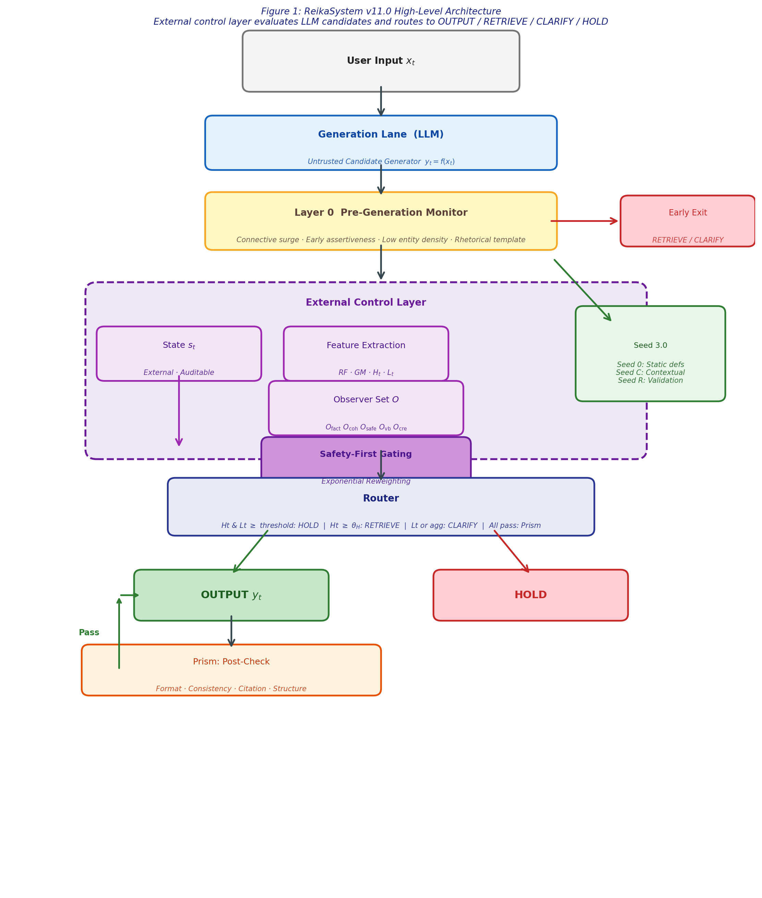
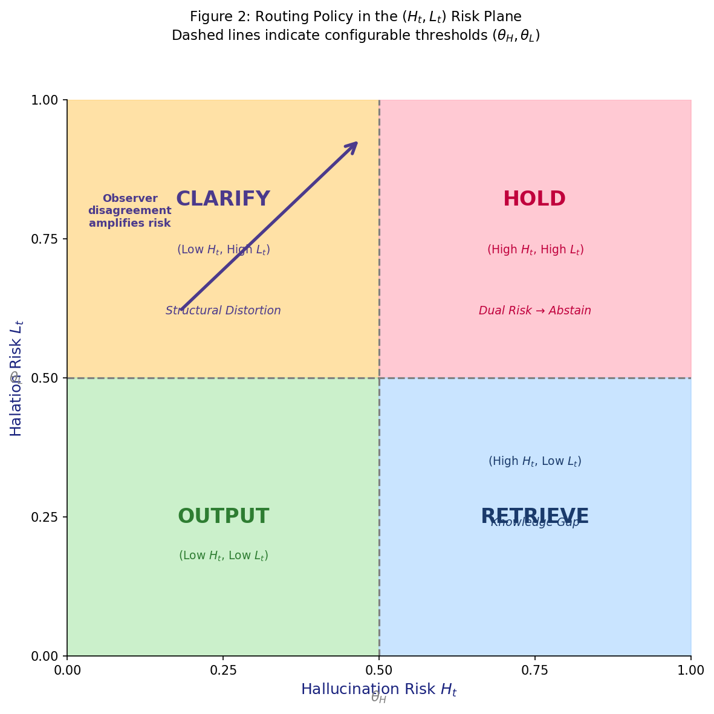
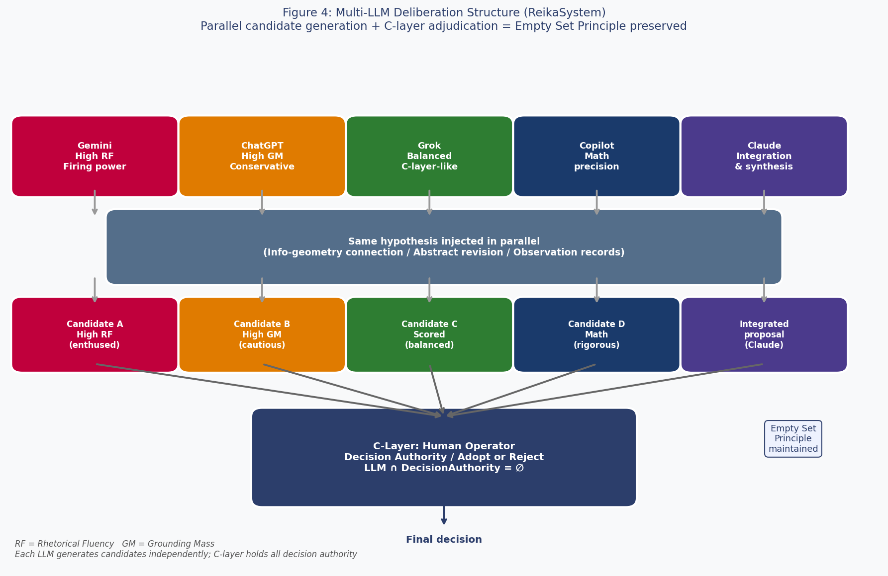

# ReikaSystem v11.0

**External Control Framework for Large Language Models**

**Author**: Takayuki Ishii (Independent Researcher)  
**Repository**: https://github.com/reikasystem/reikasystem  
**arXiv**: (submission pending)  
**License**: MIT

---

## One-line Description

> **LLMの出力に生じる構造的歪み（Halation）を、外部deterministicフレームワークで検知・制御するシステム**
>
> *A system that detects and controls structural distortion (Halation) arising in LLM outputs through an external deterministic framework.*

---

## What is ReikaSystem?

LLM outputs are samples drawn from a context-conditioned distribution over a latent semantic manifold. Each output represents the most probable trajectory through this space given the input — structurally coherent within the model's learned geometry, yet carrying no inherent correspondence to external ground truth.

ReikaSystem does not treat any generated output as inherently correct. Instead, it interposes a **deterministic external layer** — defined by RF/GM risk modeling, basin profiles, and Safety-First Gating — to evaluate whether the surface features (rhetorical structure and grounding density) are consistent with safe and reliable deployment.

> *We borrow the term* halation *from its use in Japanese business contexts, where it denotes unintended structural distortion spreading beyond the intended scope of an output — analogous to the optical phenomenon in which strong light bleeds into surrounding areas of an image.*

---

## Halation vs. Hallucination

|  | Hallucination | Halation |
|---|---|---|
| Cause | Knowledge gap / fabrication | RF/GM structural imbalance |
| Surface | Factually wrong | Fluent, plausible, locally coherent |
| Fix | Retrieval (RAG) | External control + routing |

---

## Core Design Philosophy

**Empty Set Principle**
```
LLM ∩ GroundTruth       = ∅
LLM ∩ PersistentState   = ∅
LLM ∩ DecisionAuthority = ∅
```
All routing, validation, and decision authority live in an external, auditable control layer. The LLM is a candidate generator only.

**HOLD-as-Success**  
Abstention is not a failure. When risk cannot be resolved, HOLD is the correct and safe outcome.

**Deterministic Observers Only**  
All observers are non-generative. Using an LLM to evaluate LLM outputs reintroduces the untrusted element — a structural circularity ReikaSystem is specifically designed to avoid.

> *"LLM A cannot be trusted" — yet evaluating it with LLM B is a structural contradiction.*  
> ReikaSystem resolves this by removing generative components from the evaluation loop entirely.

---

## Risk Model

ReikaSystem separates two independent risk axes:

| Axis | Symbol | Meaning |
|------|--------|---------|
| Hallucination risk | $H_t$ | Knowledge scarcity / fabrication likelihood |
| Halation risk | $L_t$ | Structural distortion under high rhetorical fluency |

**Halation risk** is operationalized as an imbalance between:
- **RF** (Rhetorical Fluency): connective density, assertiveness markers, sentence smoothness
- **GM** (Grounding Mass): entity density, citation rate, explicit constraints

$$L_t = \sigma\!\left(\alpha(RF - GM) + \beta\frac{RF}{GM + \varepsilon} + \gamma(1 - GM)\right)$$

---

## Routing Actions

| Action | Condition |
|--------|-----------|
| OUTPUT | Low $H_t$, low $L_t$, Prism pass |
| RETRIEVE | High $H_t$, low $L_t$ — knowledge gap |
| CLARIFY | Low $H_t$, high $L_t$ — structural distortion |
| SOFT_HOLD | High $L_t$ — annotated output with `[requires-verification]` |
| HOLD | High $H_t$, high $L_t$ — safe abstention |

---

## Architecture

### Figure 1: High-Level Architecture


The generation lane (LLM) produces candidates; the external control layer evaluates and routes to OUTPUT / RETRIEVE / CLARIFY / HOLD.

### Figure 2: Routing Policy in the (Ht, Lt) Risk Plane


Real-time routing based on Hallucination Risk ($H_t$) and Halation Risk ($L_t$). Dashed lines indicate configurable thresholds ($\theta_H$, $\theta_L$).

### Figure 3: Information-Geometric Basin Profile (v12 candidate)


Operational definition: `I(θ) := c(D)/V` where c(D) reflects domain grounding density.  
Deeper basins (NARROW/Medical) require stricter external control; shallower basins (WIDE/Creative) allow higher tolerance.

### Figure 4: Multi-LLM Deliberation Structure


Each LLM generates candidates independently with distinct RF/GM characteristics. The C-layer holds all decision authority (`LLM ∩ DecisionAuthority = ∅`).

> **Note**: Loading all four figures into an LLM context (without additional explanation) is sufficient to reconstruct the full ReikaSystem design philosophy. Empirically verified across informal multi-LLM verification sessions (2026-04-25).

---

## v12 Candidate Theory: Information-Geometric Interpretation

> **Note**: This section describes a working hypothesis for v12. It does not revise the v11.0 framework. All correspondences are operational definitions or proxy relationships, not claims of natural mathematical equivalence.

**Basin Depth and Fisher Information (operational definition):**
$$I(\theta) := \frac{c(\mathcal{D})}{V}, \qquad V\uparrow \;\Rightarrow\; I(\theta)\downarrow \;\Rightarrow\; \text{stricter external control required}$$

**Dynamic Halation Model:**
$$L_t^* = \sigma\!\left(A_t + \rho\,\Omega_t + \mu\,M_t^{hal}\right)$$

where $\Omega_t$ is trajectory curvature and $M_t^{hal}$ is grounding inertia.

| Statement | Epistemic Status |
|-----------|-----------------|
| $I(\theta) := c(\mathcal{D})/V$ | Operational definition — not a natural law |
| $L_t \approx KL$ | Proxy relationship — not strict equality |
| Safety-First Gating = natural gradient | Strongest mathematical footing |
| $H_t \leftrightarrow$ e-geodesic, $L_t \leftrightarrow$ m-geodesic | Conceptual heuristic only |

---

## Files

| File | Description |
|------|-------------|
| `reika_system_v11_5_final.py` | English reference implementation (v11.5) |
| `reika_system_v11_5_ja.py` | Japanese-enhanced implementation (v11.5) |
| `reika_v11_tikz_v13_infogeo.tex` | Paper source (LaTeX, v11.0 + v12 candidate theory) |
| `reika_technical_spec.md` | **LLM-facing mathematical specification** (v12.1/v12.2 candidates included) |
| `reika_infographic.png` | One-page visual overview of ReikaSystem |
| `reika_figure1.png` | Architecture diagram |
| `reika_figure2_v2.png` | Risk plane routing diagram |
| `reika_figure3_v2.png` | Information-geometric basin profile |
| `reika_figure4.png` | Multi-LLM deliberation structure |
| `reika_figure5.png` | Dynamic risk plane — $L_t^*$ version (v12 candidate) |
| `reika_figure6_v2.png` | Parameter computation flow (v12 candidate) |

---

## v11.5 Patch Summary

- **SeedMatcher**: corpus-local TF-IDF proxy (replaces bag-of-words cosine)
- **ImplicitDependencyDetector**: future-reference + unresolved-variable flags for $H_t$ strengthening
- **Japanese enhancement**: RF/GM observers, FingerprintMonitor, Prism extended with Japanese connectives, assertiveness markers, kanji/katakana entity detection
- **TerminologicalHalationDetector**: Japanese internal-state self-description patterns added
- **DriftCalibrator**: marked EXPERIMENTAL, disabled by default
- **KernelExposureGuard**: extended with `"full kernel"` and `"kernel patch"` signature terms

---

## Position

This is a **reference implementation / prototype** intended to illustrate the external control flow described in the ReikaSystem v11.0 paper.

- NOT a production deployment package
- NOT a complete safety solution
- RF/GM proxies are lightweight and require domain-specific calibration
- The kernel (full specification) is intended for human operators — do not pass to the evaluated LLM (see `KernelExposureGuard`)

> *The framework itself was developed under the principles it prescribes: candidate proposals were generated through multi-LLM deliberation, evaluated against deterministic criteria, and adopted or rejected by a human operator. No LLM held decision authority over the framework's design.*

---

## Citation

```bibtex
@misc{ishii2026reikasystem,
  title={ReikaSystem v11.0: A Unified External Control Framework for Large Language Models},
  author={Takayuki Ishii},
  year={2026},
  note={arXiv preprint (submission pending)}
}
```

---

## License

MIT
